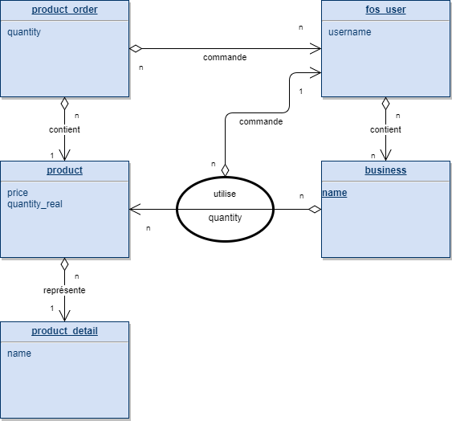

# Applepie

## Description
Applepie is a web application. The aim goal is to manage products from the stock to the business. It allow employees to add a product on the stock, to move it to a business and finally to see the total of money spent on a business.


## Database


This schema has been updated on 12/04/2017.

## Technologies
Symfony3 : API Rest backend ; use Doctrine 2, FOSRest, FOSUser.
Angular4 : front ; Semantic UI ; lodash

## What you need
* MySQL Database
* NPM with angular/cli (Install NPM and execute ```npm install -g @angular/cli```)
* Composer

## Installation
* Clone or download the project
* Go inside the project
* Launch ```composer install```. You must have a database.
* You need to have mysql as environment variable. If not, execute ```set PATH=%PATH%;C:\PATH_TO\mysql\```
* Execute this bash command ```mysql -u "root" -p "" -h "localhost" "softeurotoiture" < "script.sql"```   _("root" is your db username, the empty string is your password and "softeurotoiture" is your db name)_
* Go in front folder
* Launch ```npm install```
* Launch ```ng build```

The project is ready. if you don't have a Apache or Nginx (for example) environment, you can run (in the project racine) ```php bin/console server:run```.

## Contact / Comments
Please open an issue if needed.
